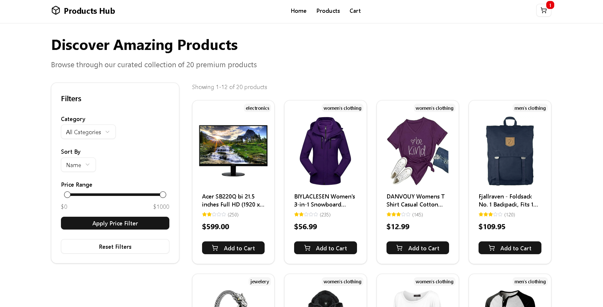
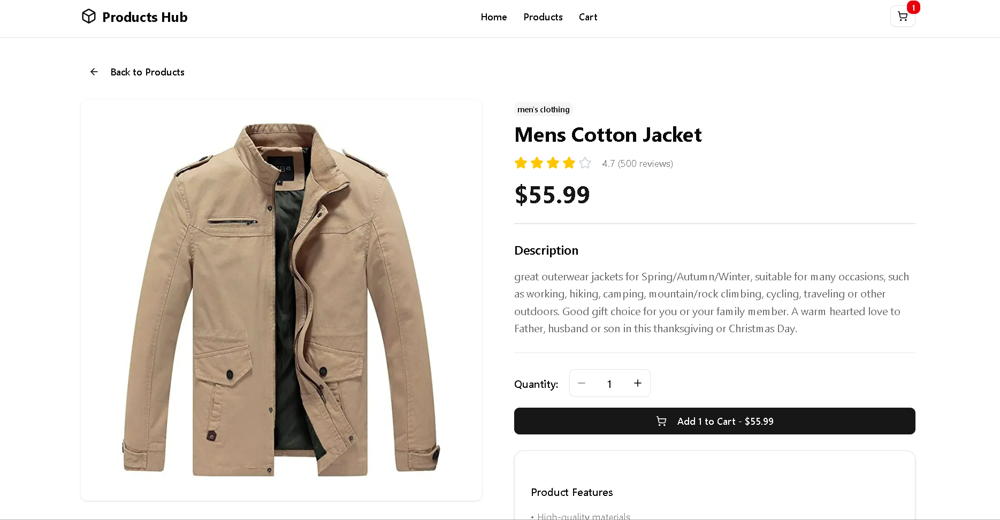
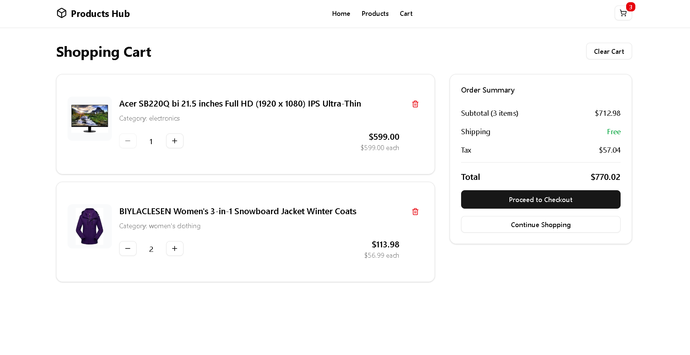

# 🛍️ Products Hub - Product Showcase Web App

### Vercel deployed link: [https://product-showcase-web-app.vercel.app](https://product-showcase-web-app.vercel.app)

A modern, responsive e-commerce product showcase built with **Next.js 15**, **TypeScript**, **Tailwind CSS**, and **shadcn/ui**. It features advanced rendering (SSG, SSR, ISR, CSR), product filtering, and a persistent shopping cart using React Context API.

## 📸 Screenshots

### Homepage

*Modern homepage with product grid and hero section*

### Product Details

*Individual product page with detailed information and add to cart functionality*

### Shopping Cart

*Persistent shopping cart with quantity controls and total calculation*

### Mobile Responsive

*Fully responsive design optimized for mobile devices*

## 🚀 Quick Setup

1. **Clone the repo**
   ```bash
   git clone https://github.com/AnkushS27/product-showcase-web-app
   cd product-showcase-web-app
   ```

2. **Install dependencies**
   ```bash
   npm install
   ```

3. **Start the dev server**
   ```bash
   npm run dev
   ```

4. **Visit**: http://localhost:3000

## 📁 Key Features

* 🏠 **Homepage** with SSG for fast load and SEO
* 📄 **Product Pages** with ISR (fresh + fast)
* 🔍 **Filtering** by category & price
* 🛒 **Cart** with localStorage support
* 🎨 **Modern UI** using shadcn/ui
* ⚡ **Optimized performance** with App Router

## 📦 Tech Stack

* **Next.js 15**, **TypeScript**
* **Tailwind CSS**, **shadcn/ui**
* **React Context API**
* **Fake Store API** for product data

## 🧪 Scripts

```bash
npm run dev        # Start dev server
npm run build      # Build for production
npm run start      # Start production server
npm run lint       # Run ESLint
npm run type-check # TypeScript checks
```

## 🔗 API Used

* [Fake Store API](https://fakestoreapi.com/)